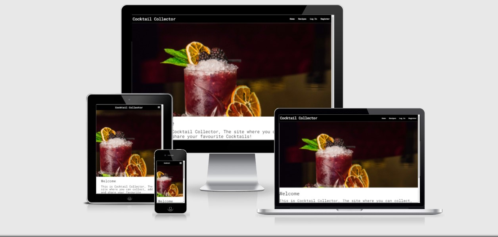

# Cocktail Collector

[View the Live website here](https://cocktail-collector.herokuapp.com/)

### Cocktail Collector is a website where users can add and share cocktail recipes.

Cocktail collector is a recipe website where users, mostly cocktail fans, can search for and post their favourite recipes, it has a recipe page where all users recipes can be viewed, it has a menber login function with ability to edit and delete recipes, and also an email sign up in the footer of the page so that users can recieve news updates.

## UX

### This website is for:

* Visitors to the website are looking for a resource to explore their interest in making cocktails, they are looking for recipes they perhaps have not heard of, and also a place to store the recipes that are their favourites.
* Hosting this website at the base level offers a service to fellow cocktail enthusiasts. It also has revenue stream possibilities once the number of users grows, this could be through advertising, but the sale of cocktail making products is also a possibility, this could be glasses, shakers etc.

### User Stories

* As a visitor to this website, I would like the navagation to be instantly understandable.
* As a visitor to this website, I would like a catalogue of recipes to browse through.
* As a visitor to this website, I would like the ability to search for cocktails, by name or by ingredients.
* As a visitor to this website, I would like the ability to register an account so I can start sharing my own recipes.
* As a visitor to this website, I would like an email sign up option, to be kept up to date with site news.
* As a visitor to this webiste, I would like the option to follow the site on social media platforms.

* As a member of the website, I would like to Login and view the recipes I have posted.
* As a member of the webiste, I would like the ability to add, edit and delete recipes.

* As an Admin of the website, I would like all of the above capabilities, but also the ability to add, edit and delete categories of recipes.

## Design 

* Colors - The entire site is rendered in black and white(apart from flash messages, which are a light blue), This was a deliberate design choice, I thought that the subject matter of the site, the cocktails, were quite colourful and vibrant themselves, which made them the main focus of the page, any other color elements would only serve to distract. 

* Font - 